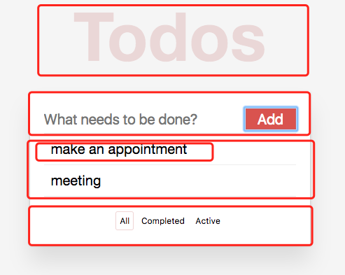

# 基于Jest和Enzyme的React单元测试

## Jest, Enzyme介绍

Jest 是 Facebook 发布的一个开源的、基于 Jasmine 框架的 JavaScript 单元测试工具。提供了包括内置的测试环境 DOM API 支持、断言库、Mock 库等，还包含了 Spapshot Testing、 Instant Feedback 等特性。

Airbnb开源的 React 测试类库 Enzyme 提供了一套简洁强大的 API，并通过 jQuery 风格的方式进行DOM 处理，开发体验十分友好。不仅在开源社区有超高人气，同时也获得了React 官方的推荐。

## 测试环境搭建

在React项目的基础上，安装 `Jest` 和 `Enzyme`:

```bash
npm install jest enzyme react-test-render --save
```

> Note:
> - 如果 `react < 15.5`，则需要安装 `react-addons-test-utils` 而不是 `react-test-render`

再安装其它相关的库

```bash
npm install babel-jest ts-jest --save
```

> Note:
> - 因为使用 es6 或 typescript 写的项目，所以需要转换器

```bash
npm install enzyme-to-json --save
```

> Note:
> - 这是用来转换 `Jest` 生成的快照

```bash
npm install identity-obj-proxy --save
```

> Note:
> - 这个是用来模拟 css 模块的

在 `package.json` 增加属性，配置Jest:

```json
  "jest": {
    "transform": {
      "^.+\\.tsx?$": "<rootDir>/node_modules/ts-jest/preprocessor.js",
      "\\.js$": "<rootDir>/node_modules/babel-jest"
    },
    "testRegex": "(/__tests__/.*|\\.(test|spec))\\.(ts|tsx|js)$",
    "moduleFileExtensions": [
      "ts",
      "tsx",
      "js"
    ],
    "moduleNameMapper": {
      "\\.(css|less)$": "identity-obj-proxy"
    },
    "moduleDirectories": [
      "node_modules"
    ],
    "snapshotSerializers": [
      "enzyme-to-json/serializer"
    ]
  },
```

> Note:
> - `transform` 配置编译器
> - `testRegex` 配置那些文件是测试文件
> - `moduleFileExtensions` 配置需要测试的文件后缀
> - `moduleNameMapper` 配置需要mock的模块
> - `moduleDirectories` 配置依赖库的目录
> - `snapshotSerializers` 配置快照转换器
> - 更多配置见Jest官方文档: [Configuring Jest](http://facebook.github.io/jest/docs/en/configuration.html)

并新增 `test` 命令:

```json
  "scripts": {
    "test": "jest"
  }
```

## 编写测试脚本

### UI组件测试

在开始编写测试脚本之前，需要先分析应用的结构。



```typescript
      <div className="container">
        <Header />
        <div className="wrapper">
          <AddTodo
          onAddClick={text => {
            this.props.dispatch(addTodo({
              text: text,
            }));
          }}
          />
          <TodoList
          todos={visibleTodos}
          onTodoClick={index => {
            this.props.dispatch(completeTodo({
              index: index,
            }));
          }}
          />
          <Footer
          filter={this.props.data.filter}
          onFilterChange={nextFilter => {
            this.props.dispatch(setVisibilityFilter({
              filter: nextFilter,
            }));
          }}
          />
        </div>
      </div>
```

可以发现，整个应用分为五个组件：

* `Header`
* `AddTodo`
* `TodoList`
* `Todo`
* `Footer`

我们以 `AddTodo`组件为例说明, 首先需要明确该组件需要测试哪些点:

* 组件是否正常渲染
* 当用户输入内容后点击添加键，是否能正常的调用 props 传递的 onAddClick(text) 方法
* 创建完成后清除 Input 的值
* 当用户没有输入任何值时，点击添加键，应该不调用 props 传递的 onAddClick(text) 方法

明确测试点后，开始编写测试脚本，详见代码。

> Note:
> - `shallow` 渲染成虚拟组件，只渲染第一层，不渲染子组件
> - `mount` 渲染成真实的DOM组件
> - `render` 渲染成静态的html字符串，返回的是一个 Cheerio 实例对象
> - `Snapshot tests` 是一个非常有用的工具，当你想保证ui没有变动时用到

### redux测试

由于 Reducer 是纯函数，所以对 Reducer 的测试很简单, 我们只需要测试 dispatch 一个 action 后 store的变化是否符合预期，详见代码。

## 测试覆盖率报告

`Jest` 提供了生成测试覆盖率报告的命令，只需要加上 `--coverage` 参数即可。

```bash
npm test -- --coverage
```

> Note:
> - 语句覆盖率（Statement coverage）
> - 分支覆盖率（Branches coverage）
> - 函数覆盖率（Function coverage）
> - 行覆盖率（Line coverage）

## 参考文档

* [Jest](http://facebook.github.io/jest/)
* [enzyme](http://airbnb.io/enzyme/)